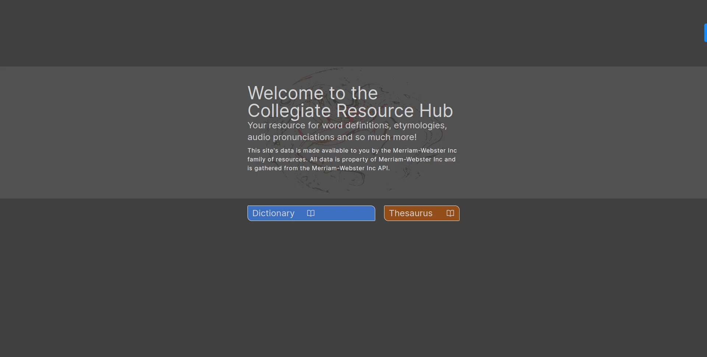
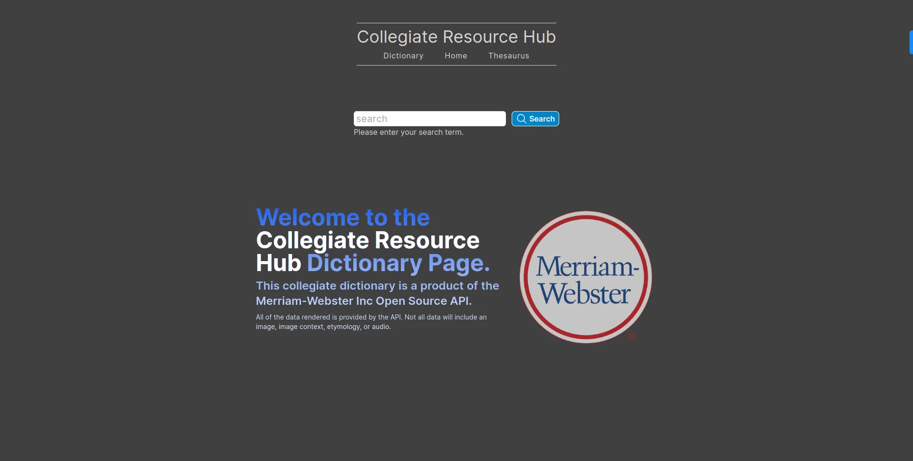
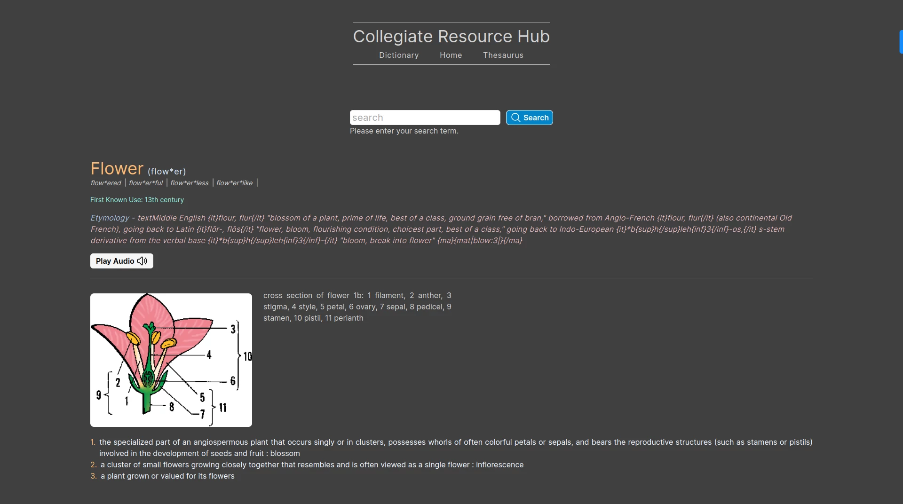
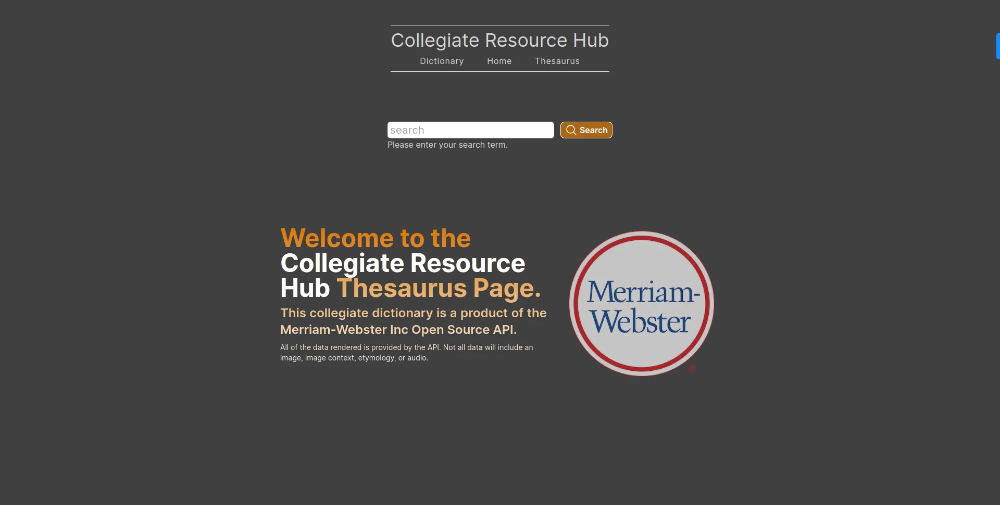
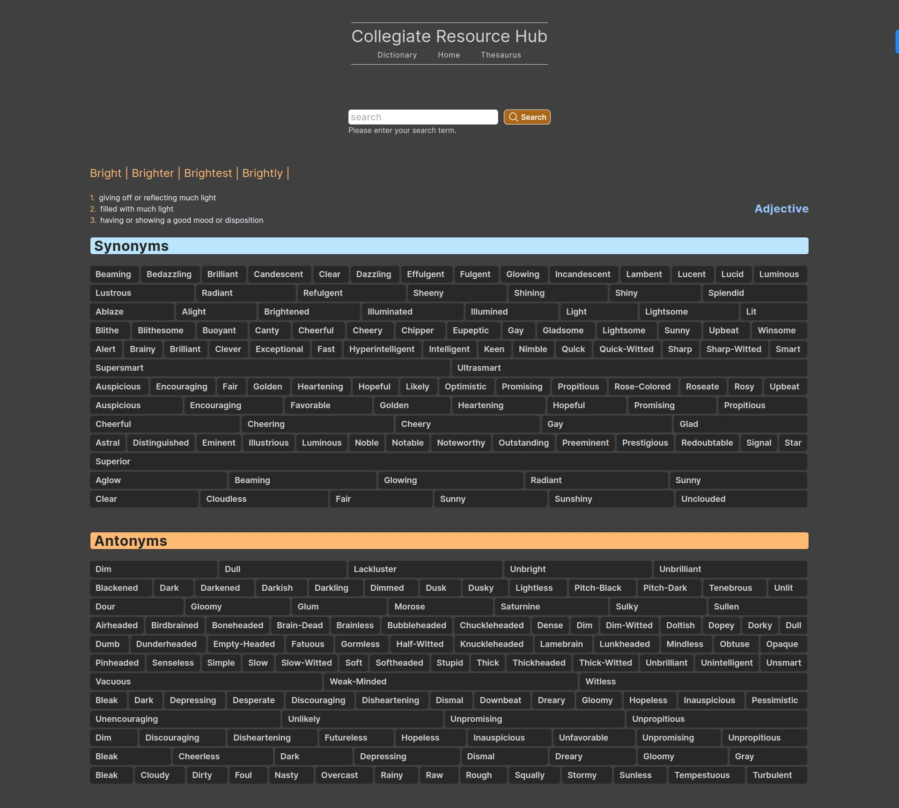
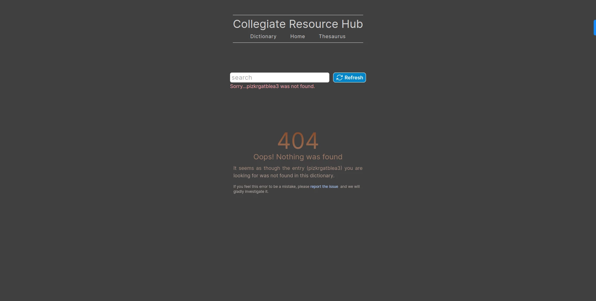
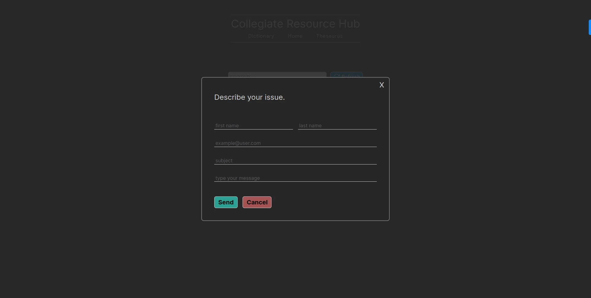

# Collegiate Resource Hub

### This is a Next.js/TailwindCSS project utilizing the Merriam-Webster Inc API of the Collegiate Dictionary and Collegiate Thesaurus endpoints.

### This API has many multi-level nested arrays and requires some deep digging to map over the sub-directories, sub-sub-directories, and so on.

### I chose this API to better my skills with Third-Party API, as I found the way this API is set up, you have no option but to write advanced JavaScript functions and manage state in the way of conditional and dynamic rendering of elements, components, and data. This app was built first as a desktop app with mobile responsive styling. I then decided to make it a bit more interesting, as far as the mobile user experience. This required lots of 'state lifting' to implement the functionality of the mobile footer.

I consider this project to be in its infant stages due to the fact that there are many more avenues to explore and build out. At this point this application only showcases the dictionary and thesaurus data points in the Merriam-Webster Inc API. However, this is a very large API, and I intend to add more features in the future.  
Check out the live site [here](https://a-collegiate-dictionary.vercel.app/)

[send me an email](mailto://fakenamedev@gmail.com) 
[reach out on LinkedIn](https://www.linkedin.com/in/william-lowrimore-dev) 
[check out my portfolio](https://www.williamlowrimore.com)
